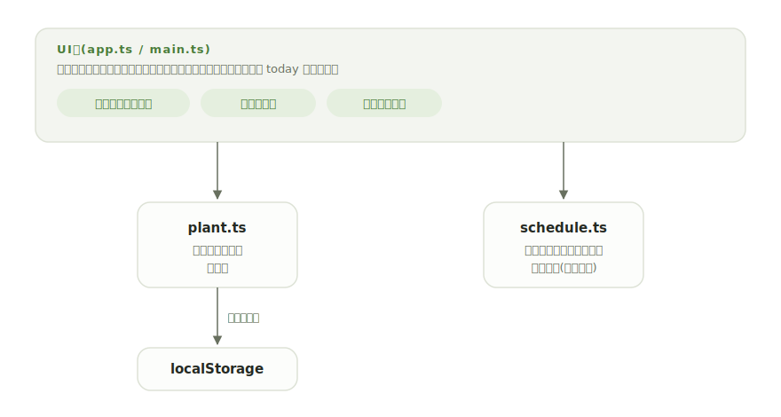

# mizuyari

[](https://github.com/miruky/mizuyari/actions/workflows/ci.yml)
[](https://github.com/miruky/mizuyari/actions/workflows/deploy.yml)

[](LICENSE)

**観葉植物の水やりと植え替えを鉢ごとの周期で管理し、今日やるべき世話が一目で分かる手帳。**

公開ページ: https://miruky.github.io/mizuyari/

## 概要

mizuyariは家の鉢植えの世話を記録する手帳である。鉢ごとに水やりの間隔(日)と植え替えの間隔(月)を決めておくと、前回の世話の日から次の予定日が計算され、鉢が「次の予定が近い順」に並ぶ。各鉢には水やり周期の進み具合を示すリングが付き、予定が近づくほど満ちていく。「水やり」を押せば記録が今日に更新され、世話のログにも残る。

水やりの記録だけでなく、置き場所の日当たり・自由メモ・鉢の写真を添えられる。一覧は水やりや植え替えが必要なものだけに絞り込んだり、名前や置き場所で並べ替えたりできる。データはブラウザのlocalStorageに保存され、サーバーには何も送らない。JSONでの書き出し・読み込みで端末間の移動やバックアップができる。

### なぜ作ったのか

水やりの失敗は「忘れる」よりも「むしろやりすぎる」ことが多く、どちらの原因も「前回いつやったか覚えていない」ことにある。汎用のリマインダーは完了で消えてしまい、サンスベリアは3週間・ポトスは5日のような鉢ごとの周期や、年単位の植え替えまでは追いづらい。鉢の一覧そのものが世話の予定表になっている形にしたかった。

## アーキテクチャ



UI層はフレームワークなしのTypeScriptで、鉢の一覧を状態が変わるたびに描き直す。予定日の計算・状態判定・世話の記録・絞り込み・テーマの解決は、いずれもDOMに依存しない純粋なモジュールに分け、そのまま単体テストできるようにしている。入場やスクロール連動の演出はGSAPに委ね、`prefers-reduced-motion` で止められる。

## 技術スタック

| カテゴリ             | 技術                           |
| :------------------- | :----------------------------- |
| 言語                 | TypeScript 5(strict)           |
| ビルド               | Vite 8                         |
| テスト               | Vitest 4                       |
| 演出                 | GSAP / ScrollTrigger           |
| リンタ・フォーマッタ | ESLint 9 / Prettier            |
| CI / 配信            | GitHub Actions / GitHub Pages  |
| 永続化               | localStorage(外部サービスなし) |

## 使い方

### 水やりの状態

次の水やり日(前回+間隔)と今日の差で、鉢に状態が付く。鉢のリングは周期の経過割合を表し、予定日に近づくほど満ちる。

| 状態       | 条件              |
| :--------- | :---------------- |
| 遅れている | 予定日を過ぎた    |
| 今日       | 予定日が今日      |
| もうすぐ   | 予定日まで2日以内 |
| 予定どおり | 予定日まで3日以上 |

「水やり」を押すと前回の日付が今日になり、次の予定が間隔ぶん先に進む。誤って押したときは、鉢の「詳細と記録」を開いて「水やりを取り消す」で一つ前の記録に戻せる。日付や間隔は詳細欄で直接編集できるので、「昨日あげたのに記録し忘れた」も前回の日付を直すだけでよい。

### 植え替え

植え替えは月単位の周期で管理する(目安として12〜24か月)。予定はあくまで「ごろ」であり、時期が来ると表示が変わる。月末の繰り上がり(1月31日の3か月後は4月30日)も正しく計算する。

### 絞り込みと並べ替え

一覧は「すべて / 水やり / 植え替え」で絞り込め、「予定が近い順 / 名前順 / 置き場所順」で並べ替えられる。選んだ条件は次回も保たれる。

### バックアップ

「バックアップ」から全鉢をJSONファイルに書き出せる。同じ画面から読み込めば、別の端末へ移したり以前の状態へ戻したりできる。読み込みは現在の鉢を置き換える。

### テーマ

右上のボタンで「端末に合わせる / ライト / ダーク」を切り替える。選択は保存され、再読み込みでもちらつかずに反映される。「端末に合わせる」のときはOSの設定に追従する。

### キーボード操作

| キー      | 動作                           |
| :-------- | :----------------------------- |
| `a` / `n` | 鉢を追加するシートを開く       |
| `Esc`     | シート・メニュー・詳細を閉じる |

## プロジェクト構成

- `index.html` — エントリポイント。描画前にテーマを解決してちらつきを防ぐ
- `src/main.ts` — 起動。ストア・テーマ・表示設定の初期化と演出の配線
- `src/app.ts` — 一覧の描画とイベント処理
- `src/icons.ts` — 線画SVGアイコン
- `src/style.css` — デザイントークンとスタイル(ライト・ダーク対応)
- `src/motion.ts` — GSAPによる入場・スクロール連動の演出
- `src/lib/plant.ts` — 鉢の型・検証・永続化・JSON入出力
- `src/lib/schedule.ts` — 予定日の計算と状態判定(日付計算込み)
- `src/lib/history.ts` — 世話の記録と取り消し
- `src/lib/filter.ts` — 一覧の絞り込みと並べ替え
- `src/lib/theme.ts` — テーマの解決
- `src/lib/photo.ts` — 鉢の写真の割り当て
- `src/lib/seed.ts` — 初回起動時の見本データ
- `docs/architecture.svg` — 構成図
- `.github/workflows/` — CI(lint・テスト・ビルド)とPagesデプロイ

## はじめ方

### 前提条件

- Node.js 22以上

### セットアップ

```bash
git clone https://github.com/miruky/mizuyari.git
cd mizuyari
npm install
npm run dev
```

### テストの実行

```bash
npm test
```

### Lintの実行

```bash
npm run lint
```

### ビルド

```bash
npm run build
```

GitHub Pagesではリポジトリ名のサブパスで配信されるため、デプロイ時は環境変数 `MIZUYARI_BASE=/mizuyari/` でViteの `base` を切り替える(`.github/workflows/deploy.yml` 参照)。

## 設計方針

- **一覧が予定表を兼ねる** — 鉢は常に次の予定が近い順に並び、進捗リングで緊急度が見える。専用の予定画面を作らず、台帳そのものに緊急度を織り込んだ。
- **記録は1タップ、訂正は1操作** — 日々の操作は「水やり」を押すだけにし、誤りは取り消しか前回の日付の修正で済むようにした。記録の正確さより継続のしやすさを取っている。
- **「今日」を引数に取る純粋関数** — 予定日の計算と状態判定は現在時刻を内部で参照せず引数で受け取る。月末の丸めや状態の境界(当日・2日前)をテストで固定できる。
- **入力は寛容に、保存は厳密に** — 保存・読み込みデータは型ガードで検証し、壊れた要素は読み飛ばし、欠けた項目は既定値で補う。古い形式のデータも読み込める。
- **演出は添えるが妨げない** — 入場とスクロール出現はGSAPで控えめにし、`prefers-reduced-motion` で完全に止まる。動きが無くても内容は最初から見える。

## ライセンス

[MIT](LICENSE)
